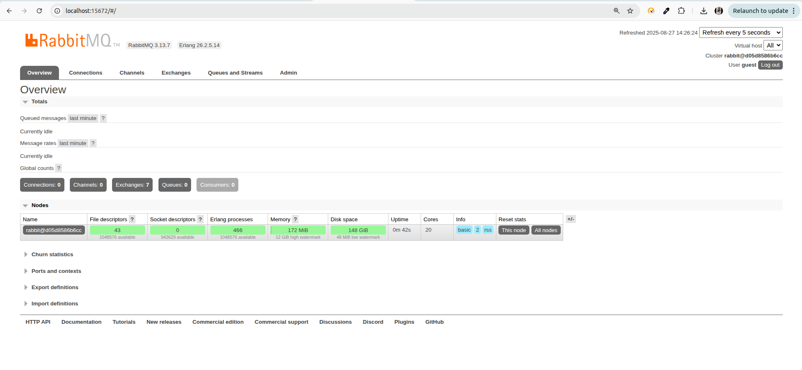
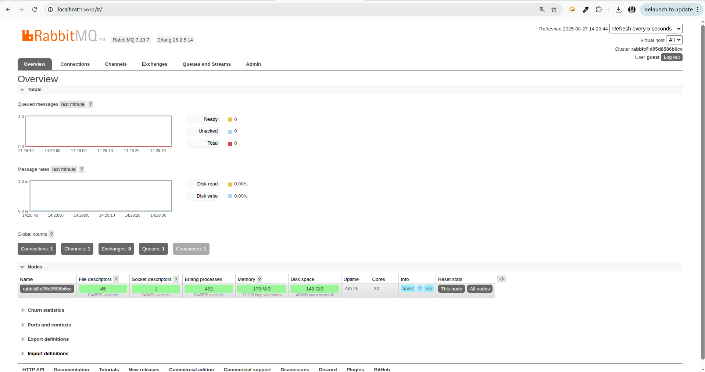
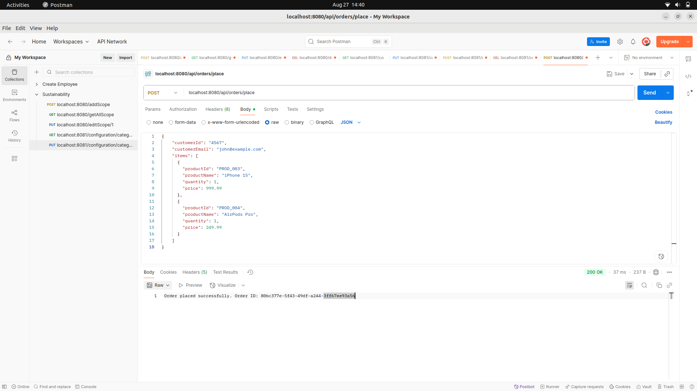
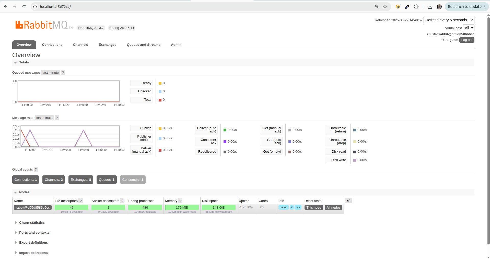
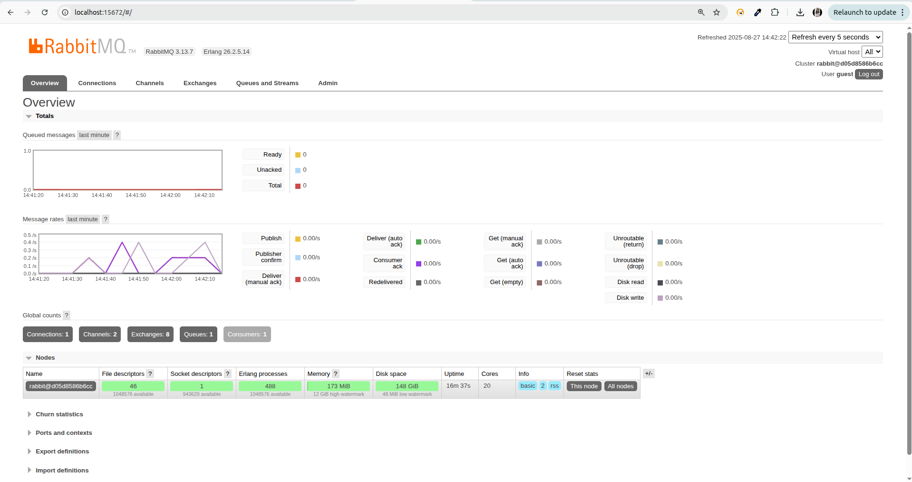
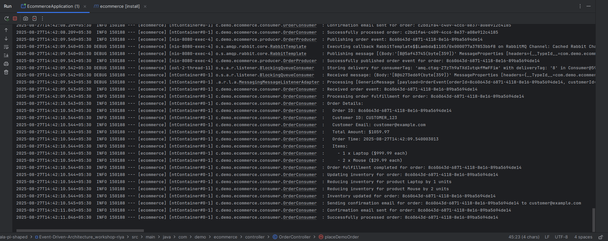

# Event-Driven Architecture Workshop - E-commerce Order Processing System
### Project Overview
This project demonstrates the core components of Event-Driven Architecture (EDA) through a practical e-commerce order processing system. The implementation showcases how producers, consumers, and message brokers work together to create loosely coupled, scalable systems.


### RabbitMQ Management Console


img.png](screenshots/RabbitMQ_Dash.png)

img.png](screenshots/RabbitMQ-Overview.png)


### Producer API Response

img.png](screenshots/Producer_Api.png)

img.png](screenshots/Producer_msgs.png)


### Consumer Logs

img.png](screenshots/consumer_logs.png)


img.png](screenshots/consumer_logs_console.png)


## Core Concept Questions & Answers
### 1. What is an Event in Event-Driven Architecture?
   An event is a significant change in state or an occurrence that happened in the past, representing a fact that cannot be changed.

Real-world Example: Consider a wedding ceremony:

Event: "Marriage Ceremony Completed"

Triggers: Guest congratulations, photographer captures moments, caterer serves reception meal, DJ starts music

Characteristics:

Immutable (the ceremony happened)

Multiple parties react independently

No direct coordination between reactions

Asynchronous responses (some immediate, some delayed)

This mirrors EDA where an "OrderPlaced" event triggers multiple independent services without direct coupling.

### 2. EDA vs Request-Response Architecture Comparison
Request-Response Architecture
What it is: Client sends request → Service returns response (like REST APIs)

#### Pros:

* Simple to implement and debug

* Immediate feedback on success/failure

* Predictable flow

* Widely supported

#### Cons:

* Tight coupling between services

* Blocking calls can cause bottlenecks

* Service failures break the chain

* Not ideal for async workflows

Event-Driven Architecture (EDA)
What it is: Publishers emit events → Subscribers react asynchronously (via message brokers like RabbitMQ/Kafka)

#### Pros:

* Loose coupling between services

* High scalability and parallel processing

* Better resilience with buffering/retries

* Real-time capabilities

* Easy to extend with new consumers

#### Cons:

* Higher complexity with more moving parts

* Harder to debug and trace flows

* Eventual consistency challenges

* Steeper learning curve

```` When to Use
Request-Response: CRUD operations, direct queries, simple workflows

Event-Driven: High-scale systems, real-time processing, decoupled microservices
````

### 3. E-commerce Scenarios with EDA

  * Placing an Order
```
   // Producer publishes single event
   OrderEvent orderEvent = OrderEvent.builder()
   .orderId(UUID.randomUUID().toString())
   .customerId(request.getCustomerId())
   .items(request.getItems())
   .totalAmount(calculateTotal())
   .status("PLACED")
   .build();

  eventPublisher.publish("OrderPlaced", orderEvent); 
  ```
* Sending Confirmation Email
```
@RabbitListener(queues = "email.queue")
public void handleOrderEmail(OrderEvent event) {
EmailTemplate template = emailTemplateService.getOrderConfirmation();
emailService.send(event.getCustomerEmail(), template, event);
}
```
* Updating Inventory
```
@RabbitListener(queues = "inventory.queue")
public void updateInventory(OrderEvent event) {
event.getItems().forEach(item -> {
inventoryService.reduceStock(
item.getProductId(),
item.getQuantity()
);
});
}
```
Benefits: Each service operates independently. If email service fails, inventory still updates. New services (analytics, recommendations) can be added without touching existing code.

### 4. Why EDA Fits Microservices & Cloud-Native Systems
   Reason 1: Natural Service Boundaries
   Microservices Philosophy: Each service owns its data and business logic

EDA Alignment: Events naturally represent business domain boundaries

Example: Order Service publishes events, Payment Service consumes them - no direct API calls needed

Reason 2: Cloud-Native Resilience
Auto-scaling: Services scale independently based on event load

Fault Tolerance: Message queues provide durability during service restarts

Geographic Distribution: Events can be replicated across regions seamlessly

``` # Kubernetes scaling based on queue depth
apiVersion: autoscaling/v2
kind: HorizontalPodAutoscaler
spec:
scaleTargetRef:
name: order-processor
metrics:
- type: External
  external:
  metric:
  name: rabbitmq_queue_messages
  target:
  value: "50" # Scale when 50+ messages in queue 
  ```
### 5. EDA for Building Scalable Systems
   Use Case 1: Social Media Platform (Twitter/Instagram)
   Traditional Approach: When user posts, directly call all follower notification APIs

Problems: Celebrities with millions of followers cause timeouts

Bottlenecks: Single server must handle all notifications synchronously

EDA Approach: Post event triggers fan-out to message queues

```
@EventHandler
public void onPostCreated(PostCreatedEvent event) {
// Process 1000 followers per message
followerService.getFollowers(event.getUserId())
.stream()
.collect(Collectors.groupingBy(/* partition by 1000 */))
.forEach(batch -> notificationQueue.send(batch));
}
``` 

Use Case 2: E-commerce Black Friday Sales
Traditional Approach: Synchronous inventory checks during checkout

Problems: Inventory service becomes bottleneck

Failures: Entire checkout fails if inventory service is down

EDA Approach: Eventual consistency with compensation patterns

```
 1. Reserve inventory optimistically
orderService.createOrder(order);
inventoryService.reserveAsync(order.getItems());

 2. Handle insufficient inventory later
@EventHandler
public void onInventoryInsufficient(InventoryInsufficientEvent event) {
    orderService.cancelOrder(event.getOrderId());
    paymentService.refund(event.getOrderId());
    emailService.sendApology(event.getCustomerEmail());
}
```