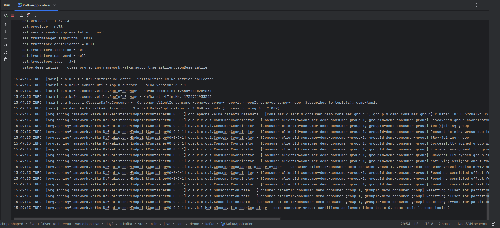

## Spring Boot Kafka Demo Application

#### A production-ready Kafka publish-subscribe application built with Spring Boot and KRaft mode.

## Quick Start

### 1. Start Kafka
```
docker-compose up -d
```

### 2. Run Spring Boot Application
```
mvn spring-boot:run
```

### 3. Test via REST API

**Send Event (Simple):**
```
curl -X POST "http://localhost:8080/api/events/simple?eventType=user_login&userId=1234"
```

**Send Event (JSON):**
```
curl -X POST http://localhost:8080/api/events \
  -H "Content-Type: application/json" \
  -d '{"eventType":"purchase","userId":"5678"}'
```



## API Endpoints

| Method | Endpoint | Description | Example                                                                                                                           |
|--------|----------|-------------|-----------------------------------------------------------------------------------------------------------------------------------|
| GET | `/api/events/health` | Health check | `http://localhost:8080/api/events/health`                                                                                         |
| POST | `/api/events/simple` | Send simple event | ` "http://localhost:8080/api/events/simple?eventType=user_login&userId=1234"`                                                     |
| POST | `/api/events` | Send JSON event | ` http://localhost:8080/api/events -H "Content-Type: application/json" -d '{"eventType":"purchase","userId":"5678"}'` |

## Configuration

All configurations are in `application.yml`:

```yaml
spring:
  kafka:
    bootstrap-servers: localhost:9092
    producer:
      acks: 1                    # Fast acknowledgment
      retries: 1                 # Minimal retries
      linger-ms: 5              # Batch messages for efficiency
    consumer:
      group-id: demo-consumer-group
      auto-offset-reset: earliest
      max-poll-records: 50       # Optimized batch size
```


img_1.png](screenshots/kafkaUI.png)


### KAFKA THEORY ANSWERS

### 1. What is the publish-subscribe model in Kafka?

The publish-subscribe (pub-sub) model in Kafka is a messaging pattern where:

> PUBLISHERS (Producers):
- Send messages to topics without knowing who will consume them
- Decouple from consumers - no direct connection needed
- Can publish to multiple topics simultaneously
- Messages are categorized by topic names

> SUBSCRIBERS (Consumers):
- Subscribe to specific topics to receive messages
- Can consume from multiple topics
- Process messages independently without affecting other consumers
- Multiple consumers can subscribe to the same topic (fan-out)

> KEY CHARACTERISTICS:
- Asynchronous communication: Publishers don't wait for consumers
- Scalability: Add/remove consumers independently
- Durability: Messages persist in topics even if no consumers are active
- Multi-consumer support: Same message can be consumed by multiple consumer groups

> EXAMPLE FROM OUR CODE:
- Producer publishes UserEvent messages to "demo-topic"
- Consumer subscribes to "demo-topic" and processes events
- REST API acts as trigger for publishing events

### 2. How does Kafka ensure message durability?

Kafka ensures message durability through multiple mechanisms:

> PERSISTENT STORAGE:
- Messages are written to disk (log files) immediately upon receipt
- Uses append-only log structure for fast sequential writes
- Data survives broker restarts and failures

> REPLICATION:
- Messages replicated across multiple brokers (configurable replication factor)
- Leader-follower replication ensures data redundancy
- If leader fails, followers can take over

> ACKNOWLEDGMENT LEVELS (acks):
- acks=0: Fire and forget (fastest, least durable)
- acks=1: Wait for leader acknowledgment (our configuration - balanced)
- acks=all: Wait for all replicas (most durable, slower)

> LOG RETENTION:
- Messages retained for configurable time period (default 7 days)
- Size-based retention also available
- Log compaction keeps latest version of each key

> TRANSACTION SUPPORT:
- Atomic writes across multiple partitions
- Exactly-once semantics with idempotent producers

> FROM OUR APPLICATION:
- docker-compose.yml sets replication factor to 1 (single node)
- Producer configured with acks=1 for balanced durability/performance
- Messages persist in /tmp/kraft-combined-logs directory

### 3. What is the role of a Kafka topic and partition?

> TOPICS:
Role: Logical categories/channels for organizing messages
- Named streams of records (e.g., "user-events", "transactions")
- Producers publish to topics, consumers subscribe to topics
- Support multiple producers and consumers simultaneously
- Immutable once written (append-only)

> PARTITIONS:
Role: Physical subdivision of topics for parallelism and scalability

> KEY BENEFITS:
- PARALLELISM: Multiple consumers can process different partitions simultaneously
- ORDERING: Messages within a partition maintain order
- SCALABILITY: Add partitions to increase throughput
- LOAD DISTRIBUTION: Messages distributed across
